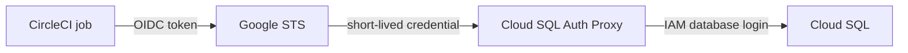

# Clear Technical Diagram Style Guide

Use this reference for polished architecture, infrastructure, authentication, CI/CD, migration, and runbook diagrams.

## Start With the Reader's Question

Write one sentence before drawing: “After viewing this diagram, the reader should understand ___.” Remove any element that does not help answer that question.

Good examples:

- How a request travels from the public load balancer to an ambient-mesh workload.
- Which repository files enable Cloud SQL IAM authentication and how those settings affect runtime.
- How CircleCI exchanges OIDC identity for a short-lived Google credential.

If the sentence contains “and,” consider creating an overview plus a detail diagram.

## Verify the Model

Create a fact table before choosing coordinates. Record the exact source for every label that can become stale:

- file and directory names;
- feature-flag names and environment coverage;
- product names and protocol names;
- service and identity boundaries;
- authentication and authorization steps;
- deprecated and target components.

Use this evidence order:

1. Current code or configuration on the relevant branch.
2. Current cloud or cluster configuration when safe to inspect.
3. Current primary documentation.
4. Jira and Confluence history for intent and context.

Treat rollout notes as historical unless the current code still enforces them.

## Choose a Layout Pattern

### Single path

Use for a request, credential, or data flow. Place nodes left to right and label only meaningful transitions.

### Swimlanes

Use when ownership or execution context matters. Typical lanes include service repository, CI/CD, GCP identity, Kubernetes runtime, and database.

### Before and after

Use for migrations. Keep corresponding components aligned so readers can compare them without tracing crossing arrows.

### Decision tree

Use for runbook diagnosis. Put observable questions in decision nodes and actions in terminal nodes. Avoid architecture detail that does not change the decision.

### Ownership map

Use when components are maintained by different teams or repositories. Group by owner and show only cross-boundary contracts.

## Build a Grid Before the Nodes

1. Set the canvas and margins.
2. Add titled panels or lanes.
3. Reserve a title band and a caption band.
4. Mark horizontal and vertical connector corridors.
5. Place nodes on a consistent grid.
6. Add arrows after the nodes are stable.
7. Add edge labels last, inside reserved whitespace.

For a 2000 × 1200 landscape canvas, useful starting values are:

- outer margin: 55–75 px;
- title band: 130–160 px;
- panel padding: 36–48 px;
- vertical gap between nodes: 24–34 px;
- horizontal connector corridor: at least 70 px;
- node corner radius: 18–24 px;
- node stroke: 2–3 px.

These are starting points, not constraints. Increase whitespace before shrinking type.

## Write Labels for Scanning

Use a two-level node:

- title: a component or action, normally two to five words;
- detail: one or two short lines describing its role.

Use verbs on edges: “exchanges token,” “routes HTTPS,” “authenticates as,” or “authorizes workload.” Do not repeat the source and destination names in the edge label.

Manually wrap labels. SVG and draw.io do not always wrap text predictably across renderers.

## Use Color as Meaning

Apply the palette consistently across a document set:

- blue: files, configuration, or general cloud resources;
- green: workload identity or healthy runtime components;
- orange: proxy, CI/CD, transition, or caution;
- purple: database identity and authorization;
- neutral gray: panels, boundaries, and external context;
- red: only for failure, destructive risk, or a blocked state.

Pair color with labels, shape, or position so the diagram remains understandable for readers with color-vision differences.

## Route Connectors Deliberately

- Prefer orthogonal or shallow curved routes.
- Keep a consistent flow direction.
- Avoid diagonal connectors across a crowded lane.
- Terminate on the nearest logical side of a node.
- Keep arrowheads outside node text bounds.
- Place labels on a dedicated horizontal segment or in clear whitespace.
- Use dashed connectors only for configuration influence, optional paths, or non-runtime relationships, and explain the convention.

When several configuration files influence one runtime node, terminate dashed lines at separated anchor points instead of stacking arrowheads and labels.

## SVG Construction

Use SVG as the canonical polished source because it is text-editable, versionable, and exports cleanly. Structure the source in this order:

1. canvas and background;
2. `<defs>` for shadows, arrowheads, and shared styles;
3. title and subtitle;
4. panels and lane headings;
5. connectors behind nodes;
6. nodes and their labels;
7. foreground annotations and callouts.

Draw connectors before nodes so nodes cover connector endpoints, but position edge labels after verifying that no node overlaps them. Prefer explicit `<tspan>` lines over automatic wrapping.

Keep a semantic CSS block near the top of the SVG. Example:

```xml
<style>
  .title { font: 700 40px Inter, Arial, sans-serif; fill: #172B4D; }
  .node-title { font: 700 19px Inter, Arial, sans-serif; fill: #172B4D; }
  .node-body { font: 400 15px Inter, Arial, sans-serif; fill: #42526E; }
  .edge { fill: none; stroke: #6B778C; stroke-width: 3; marker-end: url(#arrow); }
</style>
```

Do not depend on a font that is unavailable in the render environment; include a practical fallback stack.

## Draw.io Construction

Use draw.io when teammates need drag-and-drop editing. Keep the diagram editable rather than flattening it into one image.

Critical XML rules:

- never use backslash-escaped quotes in attributes;
- use only the five standard XML entities;
- use numeric character references or ASCII instead of HTML named entities;
- double-escape markup stored inside an XML attribute;
- keep cell IDs unique;
- validate with Python, then test in diagrams.net.

Prefer zones and alignment guides over decorative containers. Use page dimensions around 1800 × 1000 for a landscape starting point.

## Mermaid Construction

Use Mermaid for a small doc-native flow that benefits from source-controlled text. Quote labels containing punctuation or parentheses.



Move to SVG or draw.io when Mermaid layout creates crossings, cramped labels, or an unclear hierarchy.

## Render and Inspect

Always inspect the final PNG or the rendered SVG. Review it once at full resolution and once at the approximate Confluence display width.

Check:

- clipped or hidden text;
- text touching borders;
- arrows passing behind labels;
- overlapping arrowheads;
- inconsistent spacing or node sizing;
- tiny edge labels;
- ambiguous dashed-line meaning;
- missing environment or branch coverage;
- stale names copied from old documentation;
- readability in both light and dark surrounding UI.

Fix layout problems in the source and render again. Do not patch the PNG.

## Publish to Confluence Safely

Read the current page and identify the exact section the diagram supports. Place the image immediately after the overview or immediately before the detailed steps it summarizes.

Preserve every unrelated existing diagram and screenshot. When replacing a matching diagram, retain its placement and caption unless the content requires a correction.

Recommended sequence:

1. Read and save the current page body.
2. Upload the PNG with a descriptive, stable filename.
3. Insert the media node at the intended section.
4. Add a one-sentence caption.
5. Publish with a meaningful version message.
6. Re-read the page and verify the image location and surrounding code blocks.
7. If updating an attachment version, confirm the ADF media node references the current file ID.

## Failure Patterns

| Symptom | Likely cause | Correction |
|---|---|---|
| Text hidden behind a block | Labels were added after boxes without reserved space | Move the label into a connector corridor or expand the lane |
| Diagram is accurate but unreadable | Too many messages share one canvas | Split overview and implementation detail |
| Arrow crosses a node | Connectors were routed before layout stabilized | Re-route after final node placement |
| Labels are blurry in Confluence | Export is too small | Export a high-resolution PNG from the SVG source |
| Diagram says dev-only after rollout expanded | Historical rollout state was mistaken for current behavior | Verify current code and list all active environment flags |
| New image removed old screenshots | Page body was overwritten without preservation | Restore current body and modify only the intended media node |

## Final Review Questions

Ask these before delivery:

1. What will a reader understand in three seconds?
2. Which claim is most likely to become stale, and was it verified?
3. Is any text competing with a connector or border?
4. Could a node or lane be removed without losing the message?
5. Does the diagram still work at Confluence width?
6. Can a teammate edit the source later?
